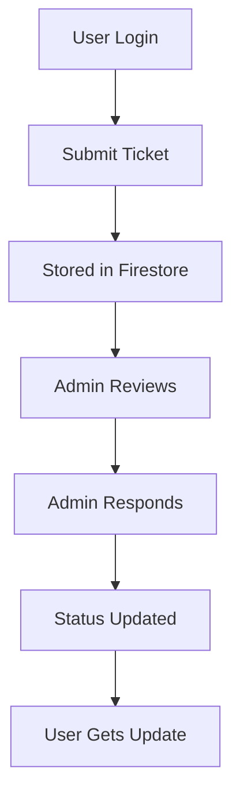

# 🎫 BIT Updates — Student Support Portal  

<p align="center">
  <a href="https://bitwupdate.vercel.app">
    
  </a>
</p>

<p align="center">
  
  
  
  
  
  
</p>

---

## 📌 Overview

**BIT Updates** is a modern, real-time student support and communication platform designed for **BIT Wardha**.  
It enables students to submit academic queries, track issue resolution, and stay updated with announcements — all in one centralized dashboard.

---

## 🌐 Live Demo

👉 **Try it here:**  
🔗 https://bitwupdate.vercel.app  

---

## ✨ Key Features

### 👨‍🎓 Student Side
- 🔐 Secure login (Google / Guest)
- 📝 Raise categorized tickets  
- 📊 Track status (Open / Closed / Mine)
- ✏️ Edit & delete own tickets
- 👤 Profile customization (PRN, Branch, Semester)

### 🛠️ Admin Panel
- ✅ Resolve / reopen tickets
- 💬 Respond to student queries
- 👥 Assign tickets
- 📢 Publish announcements
- 📊 Real-time dashboard insights

### ⚡ Core Highlights
- 🔥 Real-time Firestore sync
- 🎨 Clean glassmorphism UI
- 📱 Fully responsive
- ⚡ Fast & lightweight (no frameworks)
- 🔔 Toast alerts & modals

---

## 🧑‍💻 Tech Stack

| Category     | Technology |
|-------------|------------|
| Frontend    | HTML, Tailwind CSS, JavaScript |
| Backend     | Firebase (Auth + Firestore) |
| Deployment  | Vercel |
| Icons       | Font Awesome |
| Charts      | D3.js |

---

## 📂 Project Structure

```
bit-updates/
│── index.html        # Main application
│── README.md         # Documentation
```

---

## ⚙️ Setup Instructions

### 1️⃣ Clone Repository
```bash
git clone https://github.com/archiusx/bit-updates.git
cd bit-updates
```

### 2️⃣ Run Locally
```bash
open index.html
```

### 3️⃣ Deploy (Optional)
- Vercel (recommended)
- Netlify
- Firebase Hosting

---

## 🔐 Firebase Configuration

Replace with your own config:

```js
const firebaseConfig = {
  apiKey: "YOUR_API_KEY",
  authDomain: "YOUR_PROJECT.firebaseapp.com",
  projectId: "YOUR_PROJECT_ID",
  storageBucket: "YOUR_BUCKET",
  messagingSenderId: "XXXX",
  appId: "XXXX"
};
```

---

## 🛡️ Admin Access Control

```js
const ADMIN_EMAILS = [
  "admin@example.com"
];
```

Only these users will get admin privileges.

---

## 🧠 System Workflow



---

## 📸 UI Preview (Add Screenshots)

> Add screenshots here for better presentation

---

## ⚠️ Disclaimer

This platform is **independently developed** and not officially affiliated with DBATU or BIT Wardha.  
Always verify critical academic information via official channels.

---

## 📬 Contact

- 📧 Email: bitupdates@bitwardha.ac.in  
- 📸 Instagram: https://instagram.com/spotify.piux  
- 💼 LinkedIn: https://linkedin.com/in/piyush-deshkar  
- 💻 GitHub: https://github.com/archiusx  

---

## 🤝 Contributing

Contributions are welcome!

```bash
# Steps
1. Fork the repo
2. Create your branch
3. Commit changes
4. Open PR
```

---

## 📜 License

Licensed under the **MIT License**.

---

## 💡 Future Enhancements

- 📱 Mobile App (React Native / Flutter)
- 🔔 Push Notifications
- 📎 File Attachments
- 🤖 AI-based auto replies
- 📊 Advanced analytics dashboard

---

<p align="center">
  Built with ❤️ for students | Designed for real-world impact
</p>
