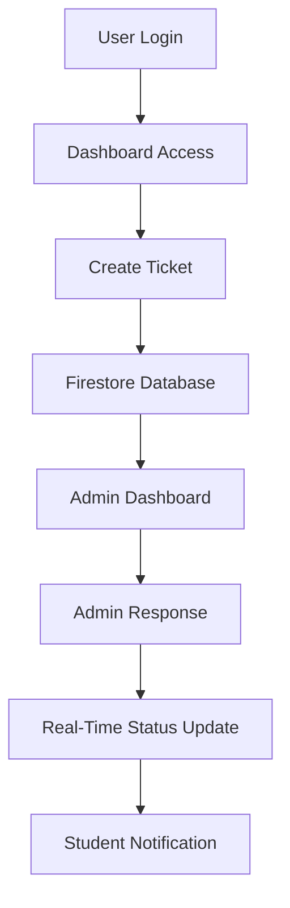

# 🎫 BIT Updates — Smart Campus Support & Communication Platform

<p align="center">
  <a href="https://bitwupdate.vercel.app">
    
  </a>
</p>

<p align="center">
  
  
  
  
  
  
  
  
</p>

---

# 📌 Overview

**BIT Updates** is a modern AI-powered smart campus platform developed for **BIT Wardha**.

The system centralizes:

* 🎫 Student issue management
* 📢 Real-time announcements
* 🏫 Campus department communication
* 🧠 AI-powered assistance
* 📚 Educational resources
* 🔔 Smart notifications
* 📊 Analytics & dashboards

It is designed as a scalable digital ecosystem that improves communication between students, faculty, departments, and administrators.

---

# 🌐 Live Demo

👉 **Open Platform**

🔗 [https://bitwupdate.vercel.app](https://bitwupdate.vercel.app)

---

# ✨ Major Features

## 👨‍🎓 Student Features

* 🔐 Google Authentication
* 👤 Personalized student profiles
* 🎫 Raise categorized support tickets
* 📊 Real-time ticket tracking
* ✏️ Edit/Delete own tickets
* 📚 Access academic resources
* 📢 View important announcements
* 🔔 Instant status updates
* 📱 Mobile responsive dashboard

---

## 🛠️ Admin Features

* ✅ Resolve/Reopen tickets
* 💬 Reply to student queries
* 📌 Prioritize and assign issues
* 📊 View analytics dashboard
* 📢 Publish campus-wide announcements
* 👥 Manage users and reports
* 🧾 Track departmental complaints
* 🔔 Broadcast important updates

---

## 🧠 AI & Smart Features

* 🤖 Gemini AI integration
* 🧠 Smart assistance workflows
* ⚡ Real-time updates using Firebase
* 📡 Public announcement system
* 📂 Resource sharing system
* 📈 Campus analytics insights
* 🏫 Infrastructure issue reporting
* 🔄 Offline-ready local storage support

---

# 🧑‍💻 Tech Stack

| Category        | Technology            |
| --------------- | --------------------- |
| Frontend        | React 19 + TypeScript |
| Build Tool      | Vite                  |
| Styling         | Tailwind CSS          |
| Backend         | Firebase              |
| Database        | Firestore             |
| Authentication  | Firebase Auth         |
| AI Integration  | Google Gemini API     |
| Charts          | Recharts              |
| Icons           | Lucide React          |
| Animation       | Motion                |
| Offline Storage | IndexedDB             |
| Deployment      | Vercel                |

---

# 📂 Project Structure

```bash
bit-updates/
│
├── src/
│   ├── App.tsx
│   ├── main.tsx
│   ├── index.css
│   └── lib/
│       └── indexedDb.ts
│
├── index.html
├── script.js
├── firestore.rules
├── database.rules.json
├── firebase-blueprint.json
├── package.json
├── vite.config.ts
├── tsconfig.json
├── vercel.json
└── README.md
```

---

# ⚙️ Installation & Setup

## 1️⃣ Clone Repository

```bash
git clone https://github.com/archiusx/bit-updates.git
cd bit-updates
```

---

## 2️⃣ Install Dependencies

```bash
npm install
```

---

## 3️⃣ Run Development Server

```bash
npm run dev
```

Application runs locally on:

```bash
http://localhost:3000
```

---

## 4️⃣ Build Production Version

```bash
npm run build
```

---

## 5️⃣ Preview Production Build

```bash
npm run preview
```

---

# 🔐 Environment Variables

Create a `.env` file:

```env
VITE_FIREBASE_API_KEY=YOUR_API_KEY
VITE_FIREBASE_AUTH_DOMAIN=YOUR_AUTH_DOMAIN
VITE_FIREBASE_PROJECT_ID=YOUR_PROJECT_ID
VITE_FIREBASE_STORAGE_BUCKET=YOUR_BUCKET
VITE_FIREBASE_MESSAGING_SENDER_ID=YOUR_SENDER_ID
VITE_FIREBASE_APP_ID=YOUR_APP_ID
VITE_GEMINI_API_KEY=YOUR_GEMINI_API_KEY
```

---

# 🔥 Firebase Setup

1. Create Firebase Project
2. Enable Authentication
3. Enable Firestore Database
4. Add Firebase Web App
5. Copy Firebase config
6. Configure Firestore Rules

---

# 🛡️ Firestore Security Rules

Example admin access:

```js
const ADMIN_EMAILS = [
  "admin@example.com"
];
```

Only authorized admins receive dashboard privileges.

---

# 🧠 System Workflow



---

# 📊 Core Modules

## 🎫 Ticket Management

* Academic complaints
* Infrastructure complaints
* Departmental issues
* Technical support requests
* Real-time ticket lifecycle

---

## 📢 Announcement System

* Emergency alerts
* College notices
* Event announcements
* Department updates
* Live campus broadcasts

---

## 📚 Resource Hub

* Notes & PDFs
* Drive links
* Department resources
* Academic materials
* Semester-based resources

---

## 📈 Analytics Dashboard

* Ticket statistics
* Department-wise analysis
* Complaint trends
* Resolution tracking
* Campus issue insights

---

# 🎨 UI/UX Highlights

* 🌌 Modern glassmorphism interface
* 📱 Fully responsive design
* ⚡ Smooth animations
* 🎯 Minimal clean layout
* 🌙 Dark-theme optimized
* 🚀 Fast loading experience

---

# 🚀 Deployment

## Deploy on Vercel

```bash
npm install -g vercel
vercel
```

---

## Alternative Hosting Platforms

* Firebase Hosting
* Netlify
* GitHub Pages

---

# 📸 Screenshots

> Add screenshots/GIFs here for better project presentation.

---

# ⚠️ Disclaimer

This project is independently developed for educational and innovation purposes.

It is not officially affiliated with:

* DBATU
* BIT Wardha
* Any government educational authority

Always verify important academic information from official institutional sources.

---

# 📬 Contact

## 👨‍💻 Developer

* 📧 Email: [bitupdates@bitwardha.ac.in](mailto:bitupdates@bitwardha.ac.in)
* 💻 GitHub: [https://github.com/archiusx](https://github.com/archiusx)
* 📸 Instagram: [https://instagram.com/spotify.piux](https://instagram.com/spotify.piux)
* 💼 LinkedIn: [https://linkedin.com/in/piyush-deshkar](https://linkedin.com/in/piyush-deshkar)

---

# 🤝 Contributing

Contributions are welcome.

## Contribution Steps

```bash
1. Fork Repository
2. Create Feature Branch
3. Commit Changes
4. Push Changes
5. Open Pull Request
```

---

# 📜 License

Licensed under the **MIT License**.

---

# 💡 Future Roadmap

* 📱 Mobile application
* 🤖 Advanced AI chatbot
* 🔔 Push notifications
* 📎 File upload support
* 🛰️ Smart campus monitoring
* 📍 Department issue heatmaps
* 📊 Advanced analytics panel
* 🧠 AI auto-ticket classification
* 🎓 Faculty management system
* ☁️ Cloudinary media storage
* 📡 Live campus public announcements
* 🏫 Smart infrastructure maintenance tracking

---

# ❤️ Vision

BIT Updates aims to transform traditional campus communication into a modern smart-campus ecosystem by combining:

* Real-time technology
* AI assistance
* Smart analytics
* Student-centric workflows
* Scalable cloud infrastructure

---

<p align="center">
  Built with ❤️ for students • Designed for real-world campus impact
</p>
